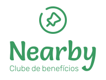
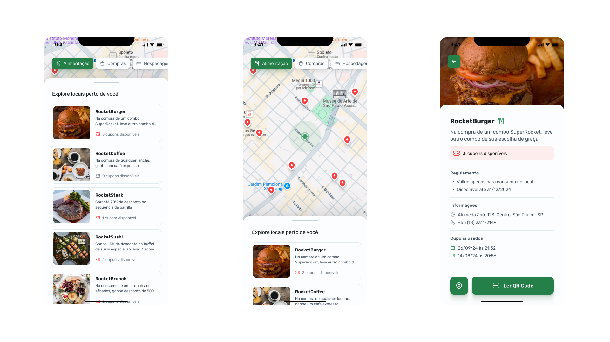

  

  

# About the project

  Nearby is a benefits club mobile application with coupons to use in establishments near you.

  This project was developed as part of the NLW Pocket Mobile (Mobile Development Challenge) by [Rocketseat](https://rocketseat.com.br/).

## features

- **Location**: finds nearby establishments based on the user's location

- **Save More**: Get access to exclusive coupons and discounts.

- **Search by category**: Filter the results by categories such as clothing, food and entertainment.

- **Scan Qr Code**: Scan the QR code at the establishment to redeem exclusive discounts.

## Technologies

- React Native
- Expo
- React Navigation
- Axios
- React Native Maps
- Expo Location

##

  
  
  

